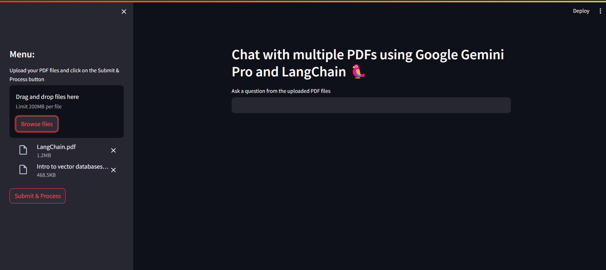
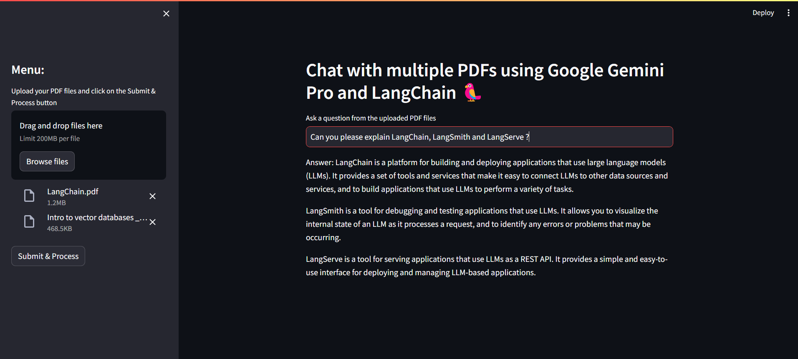
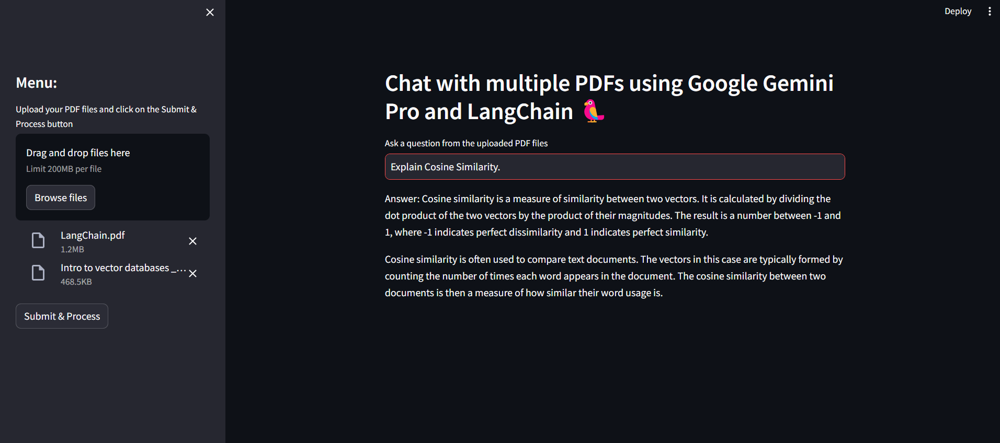

# Query Multiple PDFs using Google Gemini Pro and LangChain

### This project is designed to help users query information from multiple PDF documents effortlessly. By uploading multiple PDFs, users can ask questions related to the content within those documents, and the system will generate answers based on the processed data.

## Features

- Upload multiple PDF documents.
- Process PDFs to extract relevant information.
- Query the processed data with natural language questions.
- Get answers based on the content of the uploaded PDFs.

## Technologies Used

- Python
- Google Gemini Pro (Large Language Models)
- LangChain framework
- Streamlit (for UI)

## How to Use

1. Clone the repository to your local machine

    ```git
    git clone https://github.com/SunilBalas/Query-Multiple-PDFs-using-Google-Gemini-Pro-and-LangChain.git
2. Install the required dependencies

    ```python 
    pip install -r requirements.txt
3. Create `secrets.toml` file inside the `.streamlit` directory and add the Google API Key in the `secrets.toml` file:

    - You can create your Google API Key from [here](https://aistudio.google.com/app/apikey).
    
    ```toml
    GOOGLE_API_KEY="YOUR GOOGLE API KEY"
    ```
    > [!CAUTION]  
    > Make sure to add `secrets.toml` file to your `.gitignore` so you don't commit your secrets!
4. Run the application

    ```python
    streamlit run app.py
5. Upload your PDF documents using the provided interface
    
    

6. Ask questions related to the content of the PDFs and receive answers based on the processed data
    
    
    
    

## Contributions

- Contributions are welcome! If you find any bugs or have suggestions for improvements, feel free to open an issue or create a pull request.

1. Fork the repository

2. Create your feature branch

    ```git
    git checkout -b my-new-feature
3. Commit your changes

    ```git
    git commit -a -m 'Add some feature'
4. Push to the branch

    ```git
    git push origin my-new-feature
5. Submit a pull request

## License

- This project is licensed under the [MIT License](LICENSE).

## Acknowledgments

- Special thanks to the creators of [Google Gemini Pro](https://gemini.google.com/app) LLM and [LangChain](https://www.langchain.com/) framework for their amazing tools.
- Thanks to the [Streamlit](https://streamlit.io/) team for providing a seamless UI development experience.